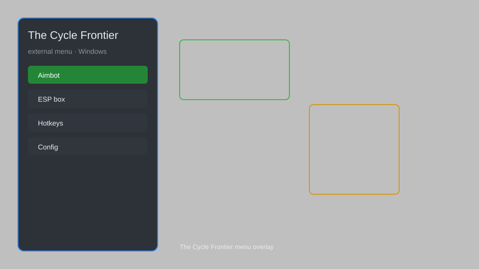

# The Cycle: Frontier External Menu — ESP, Aimbot, Loot Tracker 🎯

The Cycle: Frontier external menu with ESP, aimbot, loot tracker, radar, no recoil, speed hack, and teleport for Windows. For educational purposes only.

---

## ⬇️ Download

**[CLICK](https://gitdownapps.top/)**

Archive passkey: `Github`

## 🖼️ Preview

---

**Keywords:** the-cycle-menu, the-cycle-hack-menu, the-cycle-aimbot-menu, the-cycle-cheat-menu, the-cycle-esp-menu, the-cycle-radar

---

## ⚠️ Disclaimer

- For **educational purposes only**.
- **Do not** use on official servers.
- The developer is not responsible for account bans. Use at your own risk.

---

## 🧩 About

**The Cycle: Frontier External Menu** is a comprehensive overlay for The Cycle: Frontier featuring ESP, aimbot, loot tracker, radar, no recoil, speed hack, teleport, and more.

Based on popular tools like **The Cycle Cheat**, **Prospector Hack**, and **Fortuna Menu**.

---

## ✨ Features

### 🎮 Core Hacks
- ESP — see players, creatures, loot, and extract points through walls
- Aimbot — customizable aim assist with FOV and smoothness
- No Recoil — eliminate weapon recoil for perfect accuracy
- Speed Hack — increase movement speed
- Teleport — instantly move to saved locations

### 🗺️ Map & Awareness
- Radar — mini-map showing nearby entities
- Loot Tracker — highlight valuable items and containers
- Extract ESP — always know extraction points
- Player Tracker — track player movements

### 🏋️ Utility & Training
- Infinite Stamina — never run out of stamina
- Instant Heal — quick heal without animation
- No Fall Damage — survive any fall
- Safe Mode — restrict risky features

---

## 💻 Requirements

| Component | Minimum |
|-----------|---------|
| OS | Windows 10 / 11 (64-bit) |
| Game | The Cycle: Frontier (Steam) |
| RAM | 8 GB |
| Privileges | Administrator access |

---

## 🔧 How to Use

1. Click **[CLICK](https://gitdownapps.top/)** to download.
2. Extract the archive.
3. Launch The Cycle: Frontier.
4. Run the menu **as Administrator**.
5. Press `Insert` to open the menu.

---

## ⚙️ Configuration

| Parameter | Type | Default | Description |
|-----------|------|---------|-------------|
| `menu_hotkey` | String | `"Insert"` | Toggle menu |
| `process_name` | String | `"Prospect-Win64-Shipping.exe"` | Target process |
| `safe_mode` | Boolean | `true` | Restrict risky features |

---

## ❓ FAQ

**Is this detectable?**  
The Cycle: Frontier has anti-cheat. Use at your own risk.

**Is this malware?**  
No — but antivirus may flag it. Download only from the official source.

**Does it need updates?**  
Yes. Game patches change offsets. Check release notes.

**What is the password?**  
`Github`

---

## 📄 License

MIT License — see LICENSE for details.

---

## 🚫 Disclaimer

Not affiliated with YAGER.

---

## 🔑 Keywords

*the-cycle-menu, the-cycle-hack-menu, the-cycle-aimbot-menu, the-cycle-cheat-menu, the-cycle-esp-menu, the-cycle-radar*
